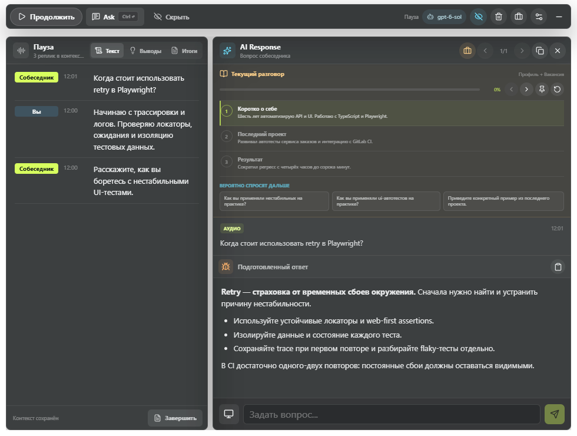
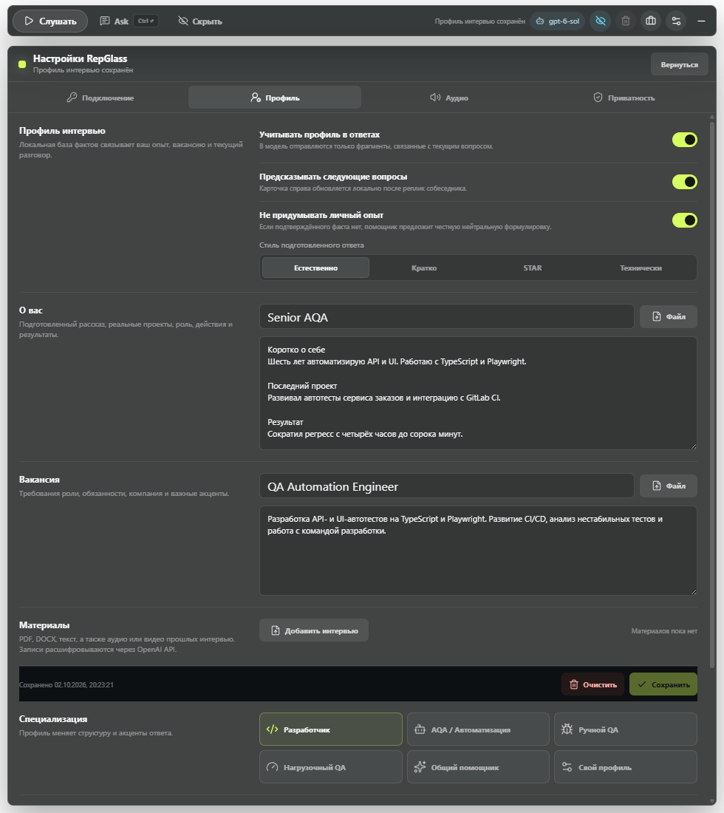
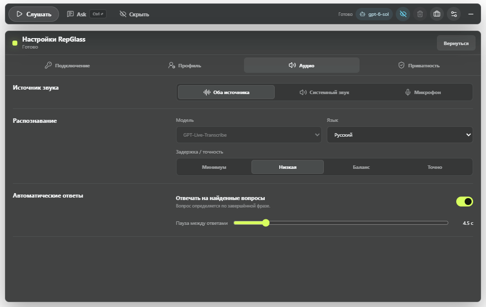
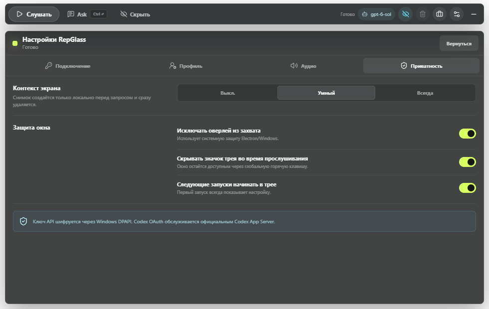
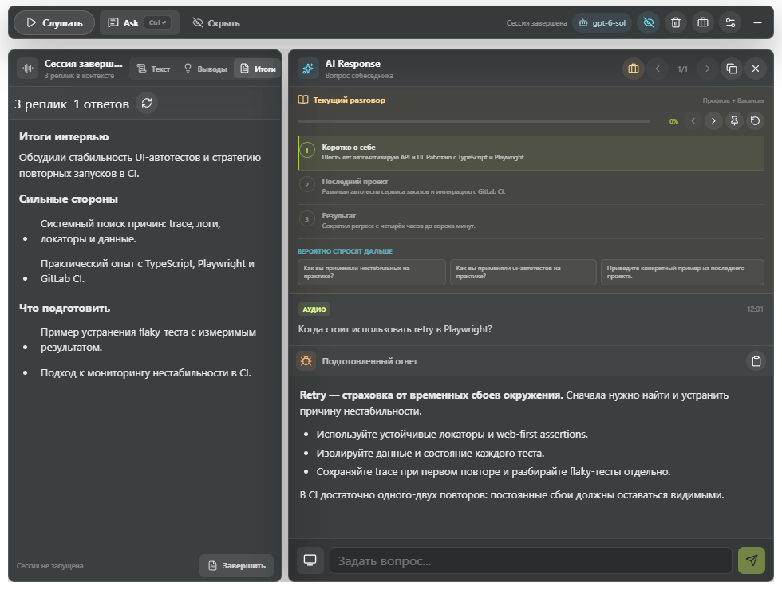

# RepGlass

RepGlass 1.3 — приватный полупрозрачный AI-ассистент для Windows. Он раздельно слушает микрофон и
системный звук, показывает транскрипцию в реальном времени, распознаёт вопросы и выводит
потоковые ответы в одном компактном overlay-окне.

Проект полностью пересобран на Electron 44, React 19, TypeScript 6, Vite 7 и Node.js 24.
Старые Firebase, Portkey, Pickle backend и web-панель не входят в приложение и удалены из
активного дерева проекта.

## Скриншоты

Интерфейс RepGlass 1.3.1. Профиль, разговор, ответ и итоги показаны на демонстрационных данных.

### Рабочее окно: Listen + Ask



### Профиль кандидата и вакансия



### Аудио и транскрипция



### Приватность



### Итоги сессии



Обновить снимки из текущих исходников на Windows:

```powershell
npm run screenshots
```

Команда собирает приложение и снимает интерфейс через Playwright с отдельным временным
профилем. Вход в аккаунт, запись звука и запросы к моделям не нужны.

## Возможности

- официальный вход ChatGPT/Codex через встроенный Codex App Server;
- ответы по подписке ChatGPT, доступной вашему аккаунту Codex;
- `GPT-Live-Transcribe` для быстрой live-транскрипции с частичными результатами;
- подсказки языков и технических терминов для русско-английских собеседований;
- актуальный список доступных моделей OpenAI API и Codex загружается при запуске;
- автоматическое определение вопросов на русском и английском;
- потоковые ответы без постоянного нажатия горячих клавиш;
- раздельные каналы «Вы» и «Собеседник» с удалением акустических дублей от колонок;
- единый контекст транскрипции, текстовых вопросов и ответов с начала текущего запуска;
- smart `Ctrl+Enter`: введённый текст, затем аудиовопрос, затем screen-only fallback;
- умный снимок текущего экрана, навсегда привязанный к использовавшему его ответу;
- Live Insights во время разговора и отдельные финальные итоги после завершения сессии;
- профили: разработчик, AQA, ручной QA, нагрузочный QA, общий и пользовательский;
- зашифрованный профиль кандидата с подготовленным рассказом, проектами и достижениями;
- целевая вакансия и перекрёстный подбор фактов по вакансии, профилю и текущему разговору;
- локальный прогноз следующих вопросов и автоматическая карточка рассказа о себе в Ask;
- динамическое прохождение рассказа: текущий блок, озвученные части и точка продолжения;
- автоматический переход на тематическое уточнение с возвратом к прерванной части истории;
- импорт `TXT`, `Markdown`, `JSON`, `CSV`, `PDF`, `DOCX`, аудио и видео прошлых интервью;
- Markdown, списки и блоки кода в карточках ответов;
- одно окно с оригинальной компоновкой Listen + Ask без технических BrowserWindow;
- работа из системного трея и глобальные горячие клавиши;
- скрытие значка трея во время прослушивания;
- системный `contentProtection` для исключения overlay из обычного захвата экрана;
- шифрование OpenAI API key через Windows DPAPI (`safeStorage`);
- временные Codex-сессии в read-only sandbox без сетевого доступа инструментов;
- установщик NSIS и portable-сборка Windows.

## Важное об авторизации

RepGlass использует два независимых способа подключения:

1. **Codex OAuth** — для текстовых и визуальных ответов. Нажмите «Войти» в приложении,
   завершите официальный вход OpenAI в браузере, после чего RepGlass использует доступные
   вашему аккаунту Codex-модели. Копировать access token или устанавливать отдельный CLI не нужно.
2. **OpenAI Platform API key** — для realtime-транскрипции. Подписка ChatGPT не является
   биллингом Platform API, поэтому STT нельзя законно авторизовать токеном Codex.

Официальные материалы: [Codex App Server](https://learn.chatgpt.com/docs/app-server),
[Realtime transcription](https://developers.openai.com/api/docs/guides/realtime-transcription),
[GPT-Live-Transcribe](https://developers.openai.com/api/docs/models/gpt-live-transcribe).

## Установка готовой версии

Последний опубликованный стабильный релиз 1.2.0 доступен на странице GitHub Releases:

- `RepGlass-Setup-1.2.0-x64.exe` — обычный установщик с ярлыками;
- `RepGlass-Portable-1.2.0-x64.exe` — portable-версия без установки.

Сборка 1.2.0 пока не подписана коммерческим Authenticode-сертификатом, поэтому Windows
SmartScreen может показать предупреждение. Загружайте EXE только из релиза этого репозитория
и сверяйте опубликованный SHA-256; для продолжения нажмите «Подробнее» → «Выполнить в любом
случае». Это предупреждение относится к отсутствию подписи, а не к отдельному PowerShell-окну:
готовый RepGlass запускается как обычное Windows-приложение.

После первого запуска RepGlass показывает настройку. На следующих запусках приложение может
сразу оставаться в трее; это меняется в разделе «Приватность».

## Сборка одной командой

Для сборки из исходников нужны Windows 10/11 x64, Git, Node.js 24 и npm 11.

```powershell
git clone https://github.com/LaRsonOFFai/RepGlass.git
cd RepGlass
npm run setup:win
```

Команда установит зависимости, выполнит typecheck/lint/tests, соберёт installer и portable,
создаст ярлык `RepGlass` и запустит готовый `RepGlass.exe` без отдельного PowerShell-окна.

Собрать без запуска:

```powershell
npm run setup:win:no-start
```

Результаты находятся в `app\release`.

## Запуск для разработки

```powershell
npm install --prefix app
npm run dev
```

Production preview уже собранного приложения:

```powershell
npm run build
npm start
```

Скрытый запуск из исходников:

```powershell
npm run start:hidden
```

## Первоначальная настройка

1. Откройте «Настройки → Подключение».
2. В блоке OpenAI Codex нажмите «Войти» и завершите вход в браузере.
3. Вставьте Platform API key в блок OpenAI API и нажмите «Сохранить».
4. В разделе «Аудио» оставьте «Оба источника», чтобы слышать собеседника и ваш микрофон.
   Режимы только системного звука или только микрофона доступны отдельно.
5. Выберите язык и задержку `GPT-Live-Transcribe`.
6. В разделе «Профиль» добавьте подготовленный рассказ о себе и описание целевой вакансии.
   При необходимости импортируйте резюме, документы или записи прошлых интервью.
7. Выберите специализацию, подробность и стиль ответа, затем нажмите «Сохранить».
8. Нажмите «Слушать».

API key создаётся на [странице OpenAI Platform](https://platform.openai.com/api-keys).
RepGlass не выводит ключ в логи и не хранит его открытым текстом.

## Профиль кандидата и вакансия

Раздел «Профиль» хранит подготовленный рассказ, факты об опыте, вакансию и дополнительные
материалы между запусками. Эти данные целиком шифруются Windows DPAPI. Для каждого вопроса
RepGlass локально выбирает до нескольких релевантных фрагментов; весь архив в модель не
отправляется.

После реплики собеседника в верхней части Ask появляется контекстная область:

- подходящие факты из опыта;
- связь с требованиями вакансии;
- до трёх вероятных следующих вопросов;
- полный подготовленный рассказ, когда просят представиться или рассказать о себе.

Подготовленный рассказ разбивается на смысловые блоки. По финальным репликам канала «Вы»
RepGlass отмечает озвученные части и прокручивает дорожку к следующей. Если собеседник прерывает
рассказ вопросом о конкретной технологии или проекте, открывается соответствующий блок, а после
ответа восстанавливается незавершённая точка основной истории. Позиция сохраняется на паузе и
сбрасывается только вместе с новой сессией. Блок можно выбрать вручную, закрепить или вернуть в
автоматический режим.

Нажатие вероятного вопроса заранее готовит ответ. Строгий режим запрещает добавлять кандидату
инструменты, цифры и достижения, которых нет в загруженных материалах. Доступны естественный,
краткий, STAR и технический стили ответа.

Текст `TXT/MD/JSON/CSV`, `PDF` и `DOCX` извлекается локально. Для аудио и видео используется
`gpt-transcribe`, поэтому для таких файлов нужен Platform API key. Загружайте записи
разговоров только с разрешения участников.

## Как работают ответы

Микрофон и системный loopback проходят через отдельные AudioWorklet/VAD/STT-конвейеры и
помечаются как «Вы» и «Собеседник». Если звук колонок попадает в микрофон, совпадающая
микрофонная транскрипция удаляется, а системная остаётся репликой собеседника. При завершении фразы собеседника локальный детектор ищет
вопросительные и командные конструкции. Если включён автоответ, найденный вопрос отправляется выбранной модели. Новые вопросы не
теряются, пока предыдущий ответ формируется: последний вопрос ставится в очередь.

Контекст начинается с первой распознанной фразы текущего запуска и содержит транскрипцию,
текстовые вопросы и предыдущие ответы. Кнопка «Пауза» сохраняет этот контекст и ничего не
переключает. Live Insights обновляются во время разговора, а финальный Summary создаётся только
по явной кнопке «Завершить». Контекст очищается кнопкой новой сессии или при полном перезапуске.
Профиль кандидата и вакансия хранятся отдельно и при очистке сессии не удаляются.

Режим экрана:

- `Выкл.` — экран не прикладывается автоматически;
- `Умный` — снимок добавляется для фраз про экран, код, ошибку, задачу или условие;
- `Всегда` — снимок добавляется к каждому ответу;
- кнопка монитора рядом с полем вопроса принудительно добавляет экран один раз.

Снимок сохраняется в `%TEMP%\RepGlass\captures`, передаётся выбранной модели и удаляется сразу
после завершения запроса. На момент захвата окно и tray RepGlass скрываются и затем
восстанавливаются, поэтому ассистент не анализирует собственный интерфейс.

## Горячие клавиши

| Сочетание | Действие |
| --- | --- |
| `Ctrl+Shift+G` | Активировать неинтерактивное окно или скрыть активное |
| `Ctrl+Shift+Q` | Открыть текстовый Ask и поставить курсор в поле вопроса |
| `Ctrl+Shift+L` | Начать или остановить прослушивание |
| `Ctrl+Enter` | Умный запрос: текст + экран → аудиовопрос + экран → только экран |
| `Ctrl+\` | Показать или скрыть окно |
| `Ctrl+Shift+Space` | Резервное сочетание для показа или скрытия окна |
| `Ctrl+стрелки` | Переместить overlay |

RepGlass не регистрирует `Ctrl+C`, `Ctrl+A` и другие обычные сочетания, поэтому копирование и
выделение текста в остальных программах не блокируются.

## Приватность и ограничения

- `BrowserWindow.setContentProtection(true)` включён по умолчанию и проверяется E2E-тестом.
- Значок трея уничтожается на время прослушивания и собственного снимка экрана.
- Windows не предоставляет универсального надёжного события «любая программа начала показ
  экрана». Если RepGlass не слушает, он не может гарантированно определить каждый внешний
  screen-share и автоматически убрать tray в ту же миллисекунду.
- Защита ОС не гарантирует скрытие от capture-card, камеры, удалённого рабочего стола,
  драйвера с повышенными правами или программы, обходящей системные API.
- Аудио передаётся в OpenAI Platform только во время активного прослушивания.
- При подготовке ответа provider получает контекст всей текущей сессии запуска, а не только
  последнюю фразу. История хранится в памяти и не записывается на диск.
- В проекте нет собственной телеметрии, Firebase, рекламного SDK или удалённого backend.

Подробнее: [пользовательский сценарий](docs/WORKFLOW.md), [приватность](docs/PRIVACY.md) и
[безопасность](docs/SECURITY.md).

## Проверка проекта

```powershell
npm run typecheck
npm run lint
npm test
npm run test:e2e
npm run verify
npm run audit:app
```

Опциональный live-тест Codex выполняет реальный запрос через текущий аккаунт:

```powershell
$env:REPGLASS_LIVE_CODEX="1"
cd app
npx playwright test --grep "streams a live Codex answer"
```

## Сборка Windows

```powershell
npm run build:win
npm run smoke:packaged
```

GitHub Actions выполняет те же проверки на `windows-latest`, затем публикует installer и
portable как workflow artifact.

## Структура

```text
app/                    Electron main/preload/React renderer и тесты
app/src/main/           OAuth, Codex App Server, STT, screen capture, secure store
app/src/renderer/       Полупрозрачный интерфейс и захват аудио
scripts/                Сборка, ярлык и скрытый запуск Windows
docs/                   Архитектура, безопасность и приватность
.github/workflows/      Проверка и выпуск Windows-артефактов
```

## Частые проблемы

**Транскрипция пуста**

- проверьте, что Platform API key сохранён и имеет доступ к API;
- для собеседования выберите «Оба источника»; система и микрофон также доступны по отдельности;
- разрешите доступ к микрофону в параметрах конфиденциальности Windows;
- убедитесь, что у выбранного приложения действительно есть аудиовывод;
- откройте режим «Текст» в панели Listen: partial-транскрипция появляется до финальной фразы.

**Codex не подключается**

- нажмите обновление статуса рядом с аккаунтом;
- повторите «Войти» и завершите браузерный flow;
- убедитесь, что `auth.openai.com` и `chatgpt.com` доступны в сети;
- перезапустите приложение после изменения корпоративной политики OpenAI.

**Окно не видно**

- нажмите значок трея или `Ctrl+Shift+G`;
- если tray скрыт во время прослушивания, используйте `Ctrl+Shift+G`;
- первый запуск всегда показывает настройки, последующие могут начинаться в трее.

## Лицензия

GPL-3.0. Репозиторий начинался как переработка открытого Glass, поэтому сохраняет совместимую
лицензию; текущий активный продукт написан заново и не запускает старый код.
